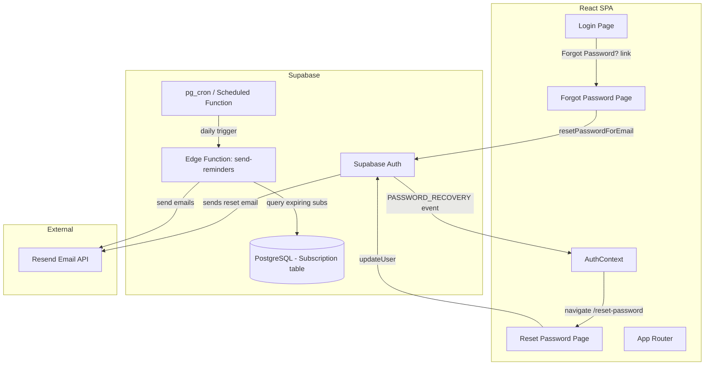
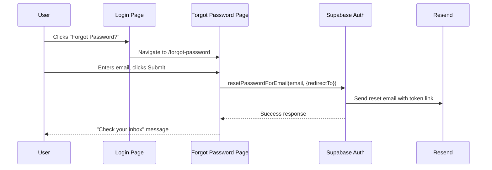
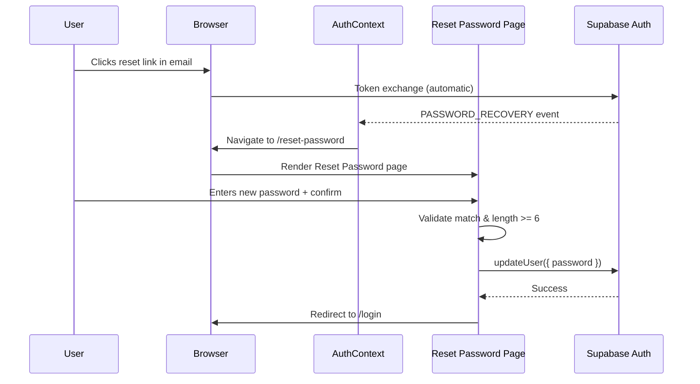
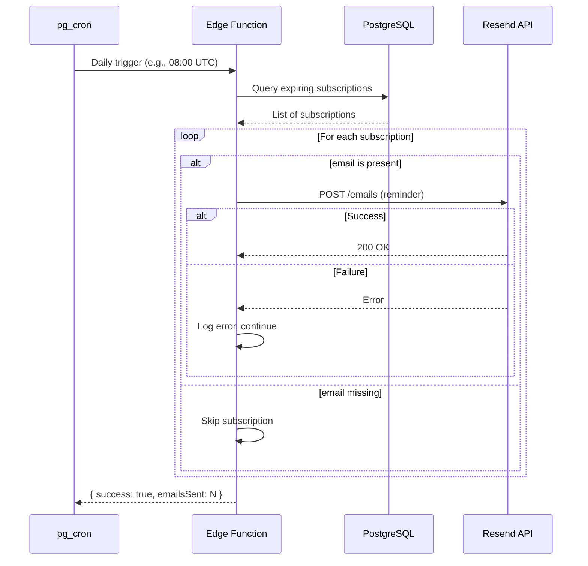

# Design Document: Email Alerts and Forgot Password

## Overview

This feature adds two capabilities to SubTrack: (1) automated daily email reminders for expiring subscriptions via the existing Supabase Edge Function and Resend, and (2) a complete forgot/reset password flow integrated with Supabase Auth. The edge function at `supabase/functions/send-reminders/index.ts` already contains the query logic and commented-out Resend integration — it needs to be activated, hardened with error handling, and scheduled via cron. The password flow adds two new pages (`ForgotPassword`, `ResetPassword`) following the existing Login page pattern, a "Forgot Password?" link on Login, and a `PASSWORD_RECOVERY` event handler in `AuthContext`.

## Architecture



## Components and Interfaces

### Component 1: Edge Function — send-reminders

**Purpose**: Query subscriptions expiring within their `reminderDays` window and send reminder emails via Resend.

**Interface**:
```typescript
// HTTP handler — invoked by Supabase cron
serve(async (req: Request) => Response)

// Response shape on success
interface SuccessResponse {
  success: true;
  emailsSent: number;
}

// Response shape on error
interface ErrorResponse {
  success: false;
  error: string;
}
```

**Responsibilities**:
- Query `Subscription` table for records with `status` in ("active", "trial") and `trialEndDate` within the next N `reminderDays`
- Skip subscriptions with missing or empty `email`
- Call Resend API for each qualifying subscription
- Log and continue on per-email failures (no halt)
- Return count of successfully sent emails

### Component 2: ForgotPassword Page

**Purpose**: Allow users to request a password reset email by entering their email address.

**Interface**:
```typescript
// Page component — rendered at /forgot-password
export function ForgotPassword(): JSX.Element
```

**Responsibilities**:
- Render email input + submit button inside a Card (matching Login.tsx style)
- Call `supabase.auth.resetPasswordForEmail(email, { redirectTo })` on submit
- Display success message on success, error toast on failure
- Provide "Back to Login" navigation link

### Component 3: ResetPassword Page

**Purpose**: Allow users arriving via the reset link to set a new password.

**Interface**:
```typescript
// Page component — rendered at /reset-password
export function ResetPassword(): JSX.Element
```

**Responsibilities**:
- Render new password + confirm password inputs + submit button inside a Card
- Validate passwords match and meet minimum 6-character length
- Call `supabase.auth.updateUser({ password })` on valid submission
- Display success message and redirect to `/login` on success
- Display error message on failure

### Component 4: AuthContext Enhancement

**Purpose**: Detect `PASSWORD_RECOVERY` auth state change and route user to reset page.

**Interface**:
```typescript
// Extended context type (no public API change)
type AuthContextType = {
  user: User | null;
  loading: boolean;
};
```

**Responsibilities**:
- Listen for `PASSWORD_RECOVERY` event in `onAuthStateChange`
- Navigate to `/reset-password` when event fires
- Maintain session so `updateUser` succeeds on the reset page

### Component 5: Route Configuration Updates

**Purpose**: Register public routes for `/forgot-password` and `/reset-password`.

**Interface**:
```typescript
// New routes added to App.tsx <Routes> block
<Route path="/forgot-password" element={<ForgotPassword />} />
<Route path="/reset-password" element={<ResetPassword />} />
```

**Responsibilities**:
- Render pages without `ProtectedRoute` wrapper (public access)
- Place alongside existing `/login` route

## Data Models

### Subscription (existing — no changes)

```typescript
interface Subscription {
  id: string;
  userId: string;
  toolName: string;
  website: string | null;
  category: string;
  purpose: string;
  status: string;          // "active" | "trial" | "cancelled" | ...
  email: string;
  trialStartDate: string | null;
  trialEndDate: string | null;
  billingCycle: string | null;
  price: number;
  currency: string;
  paymentMethod: string;
  reminderDays: number;    // default: 3
  tags: string[];
  notes: string | null;
  lastUsed: string | null;
  createdAt: string;
  updatedAt: string;
}
```

**Query for expiring subscriptions**:
```sql
SELECT * FROM "Subscription"
WHERE status IN ('active', 'trial')
  AND "trialEndDate" >= NOW()
  AND "trialEndDate" <= NOW() + INTERVAL '1 day' * "reminderDays";
```

## Sequence Diagrams

### Forgot Password Flow



### Reset Password Flow



### Daily Email Reminder Flow



## Key Functions with Formal Specifications

### Function 1: sendReminderEmails (Edge Function handler)

```typescript
async function handler(req: Request): Promise<Response>
```

**Preconditions:**
- `RESEND_API_KEY` environment variable is set and non-empty
- `SUPABASE_URL` and `SUPABASE_SERVICE_ROLE_KEY` environment variables are set
- Supabase client can connect to the database

**Postconditions:**
- Returns HTTP 200 with `{ success: true, emailsSent: N }` where N >= 0
- All subscriptions with valid email, status in ("active","trial"), and `trialEndDate` within `reminderDays` have had an email send attempted
- Subscriptions with empty/missing email are skipped (no error thrown)
- Individual Resend failures are logged but do not halt processing

### Function 2: ForgotPassword.handleSubmit

```typescript
async function handleSubmit(e: React.FormEvent): Promise<void>
```

**Preconditions:**
- `email` state is a non-empty string
- Supabase client is initialized

**Postconditions:**
- If `resetPasswordForEmail` succeeds: success message displayed, no navigation
- If `resetPasswordForEmail` fails: error toast displayed via sonner
- Loading state is true during request, false after

### Function 3: ResetPassword.handleSubmit

```typescript
async function handleSubmit(e: React.FormEvent): Promise<void>
```

**Preconditions:**
- `password` and `confirmPassword` state values are set
- User has a valid session (arrived via PASSWORD_RECOVERY flow)

**Postconditions:**
- If passwords don't match: validation error displayed, no API call
- If password < 6 characters: validation error displayed, no API call
- If `updateUser` succeeds: success toast, navigate to `/login`
- If `updateUser` fails: error message displayed

### Function 4: AuthContext PASSWORD_RECOVERY handler

```typescript
// Inside onAuthStateChange callback
(event: string, session: Session | null) => void
```

**Preconditions:**
- `onAuthStateChange` listener is active
- Event is `PASSWORD_RECOVERY`

**Postconditions:**
- User state is set from session
- Navigation to `/reset-password` is triggered

## Error Handling

### Error Scenario 1: Resend API failure for individual email

**Condition**: Resend returns non-2xx for a specific subscription email
**Response**: Log the error with subscription ID and email, increment a failure counter
**Recovery**: Continue processing remaining subscriptions; include failure count in response

### Error Scenario 2: Database query failure in Edge Function

**Condition**: Supabase query throws or returns an error
**Response**: Return HTTP 400 with `{ success: false, error: message }`
**Recovery**: Cron will retry on next scheduled run (next day)

### Error Scenario 3: resetPasswordForEmail fails

**Condition**: Network error or Supabase returns error
**Response**: Display error message via toast notification
**Recovery**: User can retry submission

### Error Scenario 4: updateUser fails on Reset Password page

**Condition**: Token expired, network error, or Supabase returns error
**Response**: Display error message on the page
**Recovery**: User must request a new reset email (link back to Forgot Password)

### Error Scenario 5: Password validation failure

**Condition**: Passwords don't match or are too short
**Response**: Inline validation error displayed, form submission blocked
**Recovery**: User corrects input and resubmits

## Testing Strategy

### Unit Testing Approach

- Test `ForgotPassword` component renders email input, submit button, and back link
- Test `ResetPassword` component renders password fields and submit button
- Test validation logic: mismatched passwords show error, short passwords show error
- Test success/error states render appropriate messages
- Mock `supabase.auth.resetPasswordForEmail` and `supabase.auth.updateUser`

### Integration Testing Approach

- Test that clicking "Forgot Password?" on Login navigates to `/forgot-password`
- Test that `/forgot-password` and `/reset-password` routes are accessible without auth
- Test that `PASSWORD_RECOVERY` event in AuthContext triggers navigation
- Test edge function with mocked Supabase client and Resend API

## Security Considerations

- The reset token is generated and validated entirely by Supabase Auth — no custom token logic
- The `redirectTo` URL in `resetPasswordForEmail` must point to the app's own domain to prevent open redirect
- The Edge Function uses `SUPABASE_SERVICE_ROLE_KEY` (server-side only, never exposed to client)
- `RESEND_API_KEY` is stored as a Supabase secret, not in client-side code
- Password minimum length (6 chars) enforced both client-side and by Supabase Auth server-side

## Dependencies

- **@supabase/supabase-js** (existing) — Auth client for `resetPasswordForEmail`, `updateUser`, `onAuthStateChange`
- **react-router-dom** (existing) — Routing for new pages, `useNavigate` for programmatic navigation
- **sonner** (existing) — Toast notifications for success/error feedback
- **shadcn/ui** (existing) — Card, Button, Input, Label components for page layout
- **Resend** (external service) — Email delivery for subscription reminders and password reset emails
- **pg_cron / Supabase Scheduled Functions** (infrastructure) — Daily trigger for the edge function

## Correctness Properties

*A property is a characteristic or behavior that should hold true across all valid executions of a system — essentially, a formal statement about what the system should do. Properties serve as the bridge between human-readable specifications and machine-verifiable correctness guarantees.*

### Property 1: Reminder email targeting correctness

*For any* set of subscriptions in the database, the edge function SHALL only attempt to send emails to subscriptions where `status` is "active" or "trial" AND `trialEndDate` is within the next `reminderDays` days AND `email` is non-empty.

**Validates: Requirements 1.1, 1.5**

### Property 2: Edge function resilience

*For any* batch of qualifying subscriptions, if the Resend API fails for one or more emails, the edge function SHALL still attempt delivery for all remaining subscriptions and return a successful response with the count of emails actually sent.

**Validates: Requirements 1.3, 1.4**

### Property 3: Password validation — match requirement

*For any* pair of password inputs on the Reset Password page, if the two values are not identical strings, the form SHALL display a validation error and SHALL NOT call `updateUser`.

**Validates: Requirement 4.3**

### Property 4: Password validation — minimum length

*For any* password string shorter than 6 characters, the Reset Password page SHALL display a validation error and SHALL NOT call `updateUser`.

**Validates: Requirement 4.4**

### Property 5: PASSWORD_RECOVERY navigation

*For any* `PASSWORD_RECOVERY` auth state change event emitted by Supabase, the AuthContext SHALL navigate the user to `/reset-password`.

**Validates: Requirement 5.1**

### Property 6: Public route accessibility

*For any* unauthenticated user, the routes `/forgot-password` and `/reset-password` SHALL render their respective pages without redirecting to `/login`.

**Validates: Requirements 6.1, 6.2, 6.3**
