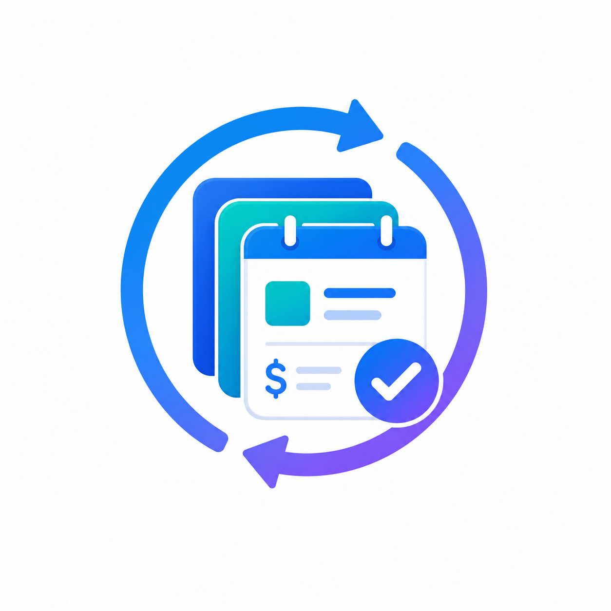

# SubTrack



> **Never lose track of a free trial again.** SubTrack is a subscription and trial tracker SaaS web app that helps you manage all your software subscriptions, monitor free trials, and get email reminders before you're charged.

[](https://react.dev)
[](https://www.typescriptlang.org)
[](https://vitejs.dev)
[](https://tailwindcss.com)
[](https://supabase.com)
[](LICENSE)

---

## Features

- **Authentication** — Sign up, sign in, forgot password, and reset password flows powered by Supabase Auth
- **Dashboard** — At-a-glance stats: active subscriptions, monthly spend, trials ending soon, and duplicate trial detection
- **Subscription management** — Add, edit, and delete subscriptions with support for multiple trial accounts per tool
- **Multiple views** — List, detail, calendar, and alerts views for your subscriptions
- **Accounts & payment methods** — Track which accounts and cards are tied to each subscription
- **Email reminders** — Automated email alerts before trials expire via Supabase Edge Functions and the Resend API
- **Real-time updates** — Live data sync across tabs and sessions using Supabase Realtime
- **Dark / light theme** — System-aware theme toggle with persistent preference
- **Row Level Security** — All database tables are protected with Supabase RLS policies so users only ever see their own data

---

## Tech Stack

| Layer | Technology |
|---|---|
| Framework | React 18, TypeScript |
| Build tool | Vite 6 |
| Styling | Tailwind CSS v4 |
| UI components | shadcn/ui (Radix UI primitives) |
| Icons | Lucide React |
| Charts | Recharts |
| Routing | React Router v7 |
| Backend / Auth / DB | Supabase (Auth, PostgreSQL, Realtime) |
| Email delivery | Resend API |
| Animations | Framer Motion (`motion/react`) |
| Toasts | Sonner |

---

## Getting Started

### Prerequisites

- [Node.js](https://nodejs.org) v18 or later
- [npm](https://www.npmjs.com) v9 or later (or [pnpm](https://pnpm.io))
- A [Supabase](https://supabase.com) project (free tier works fine)

### Installation

1. **Clone the repository**

   ```bash
   git clone https://github.com/your-username/subtrack.git
   cd subtrack
   ```

2. **Install dependencies**

   ```bash
   npm install
   ```

### Environment Setup

3. **Create your `.env` file** in the project root:

   ```env
   VITE_SUPABASE_URL=https://your-project-ref.supabase.co
   VITE_SUPABASE_ANON_KEY=your-anon-public-key
   ```

   You can find both values in your Supabase project under **Settings → API**.

   > **Never commit `.env` to version control.** It is already listed in `.gitignore`.

### Database Setup

4. **Run the migration script** to create all tables and RLS policies:

   - Open your Supabase project dashboard
   - Go to **SQL Editor → New Query**
   - Paste the contents of `supabase_migration.sql` and click **Run**

   This creates the `subscriptions` table along with all Row Level Security policies and triggers.

---

## Running Locally

```bash
npm run dev
```

The app will be available at [http://localhost:5173](http://localhost:5173).

---

## Building for Production

```bash
npm run build
```

The production-ready output is written to the `dist/` directory. Deploy it to any static hosting provider (Vercel, Netlify, Cloudflare Pages, etc.).

---

## Email Reminders Setup (Optional)

SubTrack can send automated email reminders before trials expire. This requires deploying a Supabase Edge Function and connecting it to the [Resend](https://resend.com) email API.

### 1. Deploy the Edge Function

```bash
supabase functions deploy send-reminders
```

The function source lives at `supabase/functions/send-reminders/`.

### 2. Set Edge Function environment variables

In your Supabase project under **Settings → Edge Functions**, add the following secrets:

| Variable | Description |
|---|---|
| `RESEND_API_KEY` | Your Resend API key |
| `APP_URL` | The public URL of your deployed SubTrack app |
| `FROM_EMAIL` | The sender address (e.g. `reminders@yourdomain.com`) |
| `SUPABASE_URL` | Your Supabase project URL |
| `SUPABASE_SERVICE_ROLE_KEY` | Your Supabase service role key (keep this secret) |

### 3. Schedule the function

Run the scheduling migration in the Supabase SQL Editor:

```
supabase/migrations/20240101000000_schedule_send_reminders.sql
```

This sets up a cron job via `pg_cron` to invoke the Edge Function on a daily schedule.

---

## Project Structure

```
subtrack/
├── public/                         # Static assets (favicon, logo)
├── src/
│   ├── app/
│   │   ├── App.tsx                 # Root component: routes + auth provider
│   │   ├── components/
│   │   │   ├── Layout.tsx          # App shell (sidebar, header)
│   │   │   ├── ThemeProvider.tsx   # Dark/light theme context
│   │   │   ├── ToolIcon.tsx        # Service logo/icon helper
│   │   │   └── ui/                 # shadcn/ui component library
│   │   ├── contexts/
│   │   │   └── AuthContext.tsx     # Supabase auth state + helpers
│   │   ├── data/
│   │   │   ├── useSubscriptions.ts # Main data hook (fetch + realtime)
│   │   │   └── subscriptions.ts    # Shared TypeScript types
│   │   └── pages/
│   │       ├── Dashboard.tsx
│   │       ├── Subscriptions.tsx
│   │       ├── SubscriptionDetail.tsx
│   │       ├── AddSubscription.tsx
│   │       ├── CalendarView.tsx
│   │       ├── Alerts.tsx
│   │       ├── Accounts.tsx
│   │       ├── PaymentMethods.tsx
│   │       ├── Login.tsx
│   │       ├── ForgotPassword.tsx
│   │       └── ResetPassword.tsx
│   ├── lib/
│   │   └── supabase.ts             # Supabase client initialisation
│   ├── styles/                     # Global CSS
│   └── main.tsx                    # App entry point
├── supabase/
│   ├── functions/send-reminders/   # Edge function for email alerts
│   ├── migrations/                 # Database migrations
│   └── templates/                  # Email HTML templates
├── prisma/schema.prisma            # Prisma schema (alternative DB setup)
├── supabase_migration.sql          # Main DB setup script (run this first)
├── index.html
├── package.json
└── vite.config.ts
```

---

## Security Notes

- All database access is protected by **Row Level Security** — users can only read and write their own rows.
- The Supabase **anon key** is safe to expose in the frontend; it has no elevated privileges.
- The **service role key** (used only in the Edge Function) must never be committed or exposed to the browser.
- Passwords entered in the "Password / Notes" field on the Add Subscription form are stored as plain text in the `notes` column. Use a password manager link rather than the actual password.

---

## Contributing

Contributions are welcome. Here's how to get started:

1. Fork the repository
2. Create a feature branch: `git checkout -b feat/your-feature-name`
3. Commit your changes: `git commit -m "feat: add your feature"`
4. Push to your fork: `git push origin feat/your-feature-name`
5. Open a pull request against `main`

Please keep PRs focused and include a clear description of what changed and why.

---

## License

This project is licensed under the [MIT License](LICENSE).

---

<p align="center">Built with ❤️ using React + Supabase</p>
